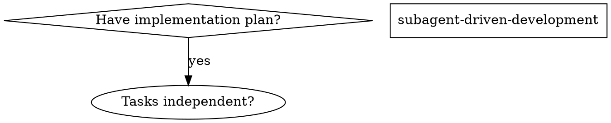
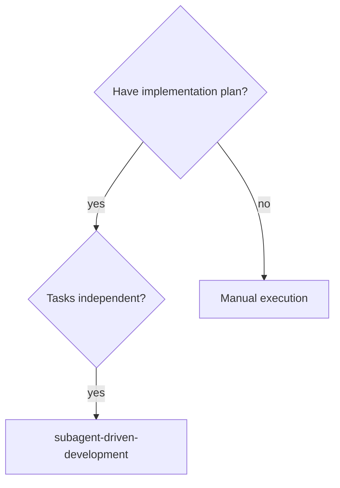

# Skill Sync Procedure: Superpowers → Super-Roo

Guide for syncing skills from [obra/superpowers](https://github.com/obra/superpowers) to Super-Roo's `.roomodes` format.

## Overview

Super-Roo adapts Superpowers skills for use with Roo Code's custom modes system. This involves format conversion, syntax translation, and content adaptation.

## Source & Target

**Source:** `C:\Users\blewis\.claude\plugins\cache\superpowers-marketplace\superpowers\{version}\skills\`

```
skills/
  {skill-name}/
    SKILL.md              # Main skill content (YAML frontmatter + markdown)
    *.md                  # Optional separate prompt template files
```

**Target:** `.roomodes` (YAML file at project root)

```yaml
customModes:
- slug: skill-name              # kebab-case identifier
  name: Skill Name              # Title Case display name
  description: Brief description of what skill does
  roleDefinition: |             # Full skill content as multi-line string
    # SKILL: SKILL NAME

    [content...]
  whenToUse: 'Use this mode when you need to: [action]'
  groups:
  - read
  - edit
  - command
```

## Key Transformations

### 1. Graphviz → Mermaid Flowcharts

Superpowers uses Graphviz DOT format; Super-Roo uses Mermaid.

**Source (Graphviz):**


**Target (Mermaid):**


**Conversion rules:**
| Graphviz | Mermaid |
|----------|---------|
| `[shape=diamond]` | `{text}` (decision) |
| `[shape=box]` | `[text]` (process) |
| `->` with `[label="x"]` | `-->\|x\|` |
| Quoted node names | Single-letter IDs (A, B, C) |
| `digraph` | `flowchart TD` or `flowchart TB` |

### 2. TodoWrite → new_task()

| Superpowers | Super-Roo |
|-------------|-----------|
| `TodoWrite` with all tasks | `new_task()` for each task |
| Mark task complete in TodoWrite | `attempt_completion` with result |
| TodoRead to check status | Check task context directly |

### 3. Inline Prompt Templates

Superpowers references separate files; Super-Roo inlines them.

**Source:**
```markdown
## Prompt Templates
- `./implementer-prompt.md`
- `./spec-reviewer-prompt.md`
```

**Target:**
```markdown
## Prompt Templates

### Implementer Subagent Prompt
\`\`\`
new_task(
  mode: "test-driven-development",
  task: |
    You are implementing Task N: [task name]
    [full prompt content here]
)
\`\`\`
```

### 4. Skill Reference Translation

| Superpowers | Super-Roo |
|-------------|-----------|
| `superpowers:finishing-a-development-branch` | `finishing-a-development-branch` |
| `superpowers:test-driven-development` | `test-driven-development` |

### 5. Content Cleanup

**Remove:**
- Marketing language ("Advantages", "Cost" sections)
- Promotional content

**Consolidate:**
- Multiple warning sections → single "Red Flags" section
- Scattered "when to use" notes → explicit "When To Apply" list

**Add:**
- `## SKILL COMPOSITION` section with new_task() patterns
- `## COMPLETION CRITERIA` section
- `## COMMUNICATION AND TOOL USAGE` boilerplate (see below)

## Standard Boilerplate

Append to every synced skill:

```markdown
## COMMUNICATION AND TOOL USAGE

**ALWAYS communicate before using tools:**
- Explain what you're about to do BEFORE making function calls
- Output text to communicate with the user
- NEVER use bash echo or code comments as means to communicate

**Use new_task() for complex tasks:**
- Spawn subagents when task has 3+ distinct steps
- Use appropriate mode for the subtask
- Keep exactly ONE subtask in_progress at a time

**Tool usage patterns:**
- Read files in parallel when gathering context
- Explain findings after reading
- Show command output when verifying claims
```

## Implementation Order

Sync skills in dependency order:

1. **Foundational skills** (referenced by others)
2. **Skills that use foundational concepts**
3. **Complex skills that build on multiple others**

Example from Phase 2:
1. `verification-before-completion` (foundational)
2. `finishing-a-development-branch` (uses verification)
3. `subagent-driven-development` (uses both)

## Validation

After syncing, verify:

```bash
# YAML syntax validation
python -c "import yaml; yaml.safe_load(open('.roomodes'))"

# Check skill structure
python -c "
import yaml
data = yaml.safe_load(open('.roomodes'))
for m in data['customModes']:
    print(f\"{m['slug']}: {len(m.get('roleDefinition', ''))} chars\")
"
```

**Checklist:**
- [ ] YAML validates without errors
- [ ] Each mode has: slug, name, description, roleDefinition, whenToUse, groups
- [ ] No duplicate slugs
- [ ] Key content present (tables, sections, examples)
- [ ] Manual test: skill behavior matches intent

## Super-Roo Exclusives

These skills exist only in Super-Roo and should **not** be overwritten during sync:

- `condition-based-waiting`
- `defense-in-depth`
- `root-cause-tracing`
- `sharing-skills`
- `testing-anti-patterns`
- `testing-skills-with-subagents`

## Phase Reference

| Phase | Skills | Status |
|-------|--------|--------|
| Phase 1 MVP | Core 20 skills (condensed) | Merged |
| Phase 2 Tier 2 | verification-before-completion, finishing-a-development-branch, subagent-driven-development | Complete |
| Phase 3 | Remaining skills with significant updates | Planned |

See `docs/plans/feat-super-roo-sync-phase*.md` for detailed implementation plans.
