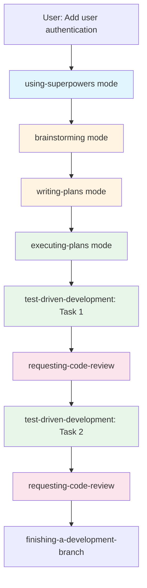
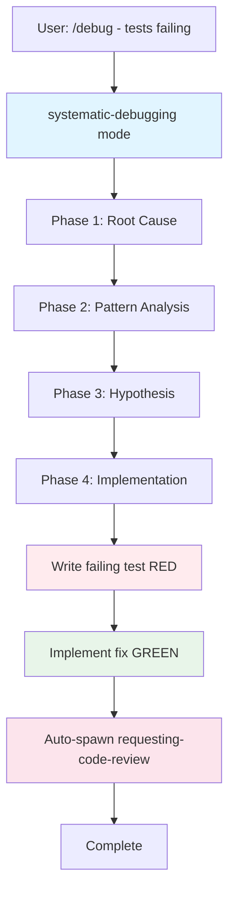
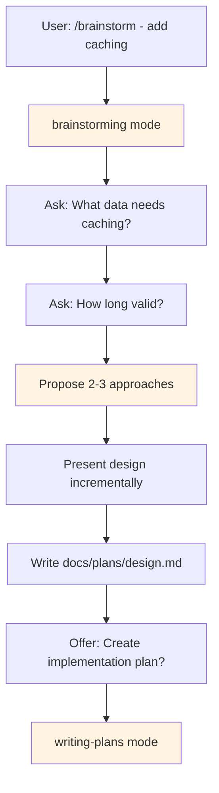
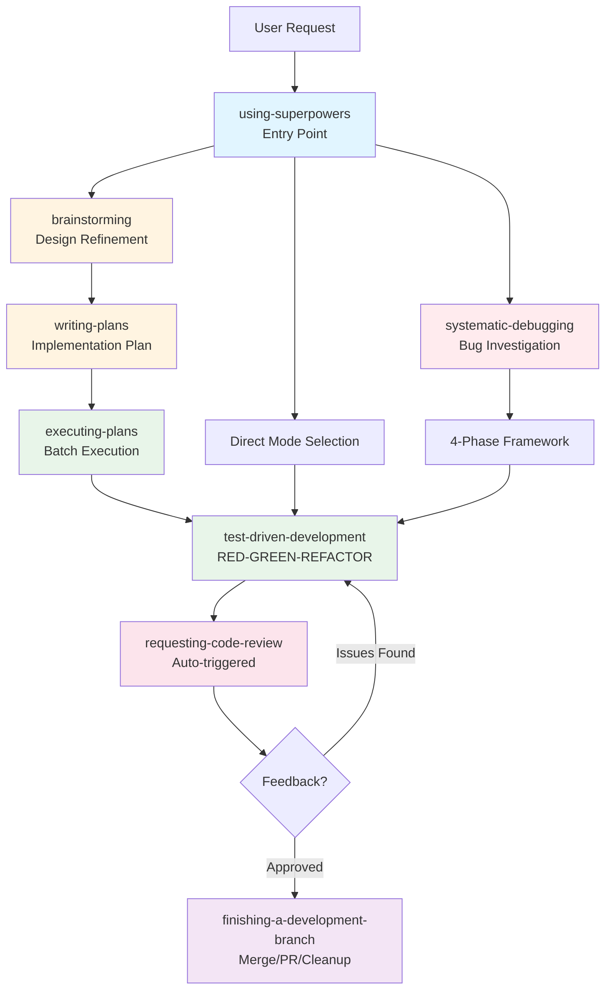

# Documentation Enhancements Design

**Date:** 2025-01-25
**Status:** Validated
**Goal:** Add troubleshooting section and visual workflow diagrams to ARCHITECTURE.md

---

## Overview

Add two enhancements to SuperRoo documentation based on code review recommendations:
1. **Troubleshooting section** - Quick reference for 5-7 common issues
2. **Visual workflow diagrams** - Four Mermaid diagrams showing workflows

Both additions go into `docs/ARCHITECTURE.md` at appropriate locations.

---

## 1. Troubleshooting Section

### Location
ARCHITECTURE.md, new section after "Installation Approaches" (~line 208)

### Content Structure

```markdown
## Troubleshooting

Quick solutions to common SuperRoo issues.

### Mode not appearing in dropdown
**Symptom:** RooCode mode selector doesn't show 20 SuperRoo skill-modes
**Solution:**
1. Verify file location: `~/.config/Code/User/roo-code-settings/customModes.json` (or Windows equivalent)
2. Restart VS Code completely (not just reload)
3. Validate YAML: `python3 -c "import yaml; yaml.safe_load(open('.roomodes'))"`

### Slash commands don't work
**Symptom:** Typing `/tdd` or `/debug` doesn't trigger commands
**Solution:**
1. Check `.roo/commands/` directory exists with 7 .md files
2. Restart VS Code
3. Verify RooCode extension is active

### Wrong mode activates
**Symptom:** Selecting one mode activates a different one
**Solution:**
1. Check for duplicate slugs in .roomodes
2. Project-specific .roomodes may override global settings

### Auto-review not triggering
**Symptom:** test-driven-development completes without spawning requesting-code-review
**Solution:**
1. Verify mode has new_task() call in roleDefinition
2. Check RooCode version supports new_task()

### Skills don't compose (subtasks fail)
**Symptom:** Modes don't spawn other modes via new_task()
**Solution:**
1. Enable auto-approval for read operations (speeds up subtasks)
2. Check RooCode console for errors

**Still having issues?**
- Check [GitHub Issues](https://github.com/Benny-Lewis/super-roo/issues)
- File a new issue with: RooCode version, error messages, steps to reproduce
```

### Design Rationale
- **Quick reference format**: Gets users unstuck fast
- **5 common issues**: Covers 80% of likely problems
- **Symptom → Solution**: Easy to scan and find your issue
- **Clear escalation**: Links to GitHub for unresolved issues

---

## 2. Visual Workflow Diagrams

### Location
ARCHITECTURE.md, enhance existing "Workflow Examples" section (~line 209)

### Approach
Add Mermaid diagrams BEFORE each text example to provide visual overview, then follow with existing detailed text walkthrough.

### Diagram 1: Feature Implementation Workflow



**Purpose:** Shows complete feature implementation workflow from idea to PR

### Diagram 2: Quick Bug Fix Workflow



**Purpose:** Shows 4-phase debugging framework and TDD integration

### Diagram 3: Design Refinement Workflow



**Purpose:** Shows Socratic brainstorming process

### Diagram 4: Comprehensive Overview



**Purpose:** Shows how all workflows relate and compose

### Color Legend
- **Blue (#e1f5ff)**: Entry points
- **Yellow (#fff4e1)**: Planning/Design modes
- **Green (#e8f5e9)**: Implementation modes
- **Red (#ffebee)**: Debugging modes
- **Pink (#fce4ec)**: Review modes
- **Purple (#f3e5f5)**: Completion modes

### Design Rationale
- **Mermaid format**: GitHub renders natively, version controlled
- **Four diagrams**: Three focused + one comprehensive (multiple learning paths)
- **Color coding**: Quick visual categorization of mode types
- **Positioned before text**: Visual overview then detailed explanation
- **Matches existing examples**: Complements, doesn't replace text

---

## Implementation Approach

### Files to Modify
1. `docs/ARCHITECTURE.md` - Add both enhancements

### Placement
1. **Troubleshooting**: New section after "Installation Approaches" (~line 208)
2. **Diagrams**: Add to "Workflow Examples" section (~line 209)
   - Diagram 1 before Example 1: Feature Implementation
   - Diagram 2 before Example 2: Quick Bug Fix
   - Diagram 3 before Example 3: Design Refinement
   - Diagram 4 at start of section as overview

### Structure After Changes
```
## Installation Approaches
  [existing content]

## Troubleshooting
  [NEW: 5-7 common issues]

## Workflow Examples
  [NEW: Diagram 4 - Comprehensive Overview]

  ### Example 1: Feature Implementation
  [NEW: Diagram 1]
  [existing text]

  ### Example 2: Quick Bug Fix
  [NEW: Diagram 2]
  [existing text]

  ### Example 3: Design Refinement
  [NEW: Diagram 3]
  [existing text]
```

---

## Success Criteria

1. **Troubleshooting section is useful**
   - Covers most common installation/usage issues
   - Solutions are actionable and clear
   - Escalation path is obvious

2. **Diagrams enhance understanding**
   - Render correctly on GitHub
   - Match workflow text descriptions
   - Color coding is intuitive
   - Comprehensive diagram shows big picture

3. **Documentation remains maintainable**
   - Mermaid syntax is simple
   - Diagrams update when workflows change
   - Troubleshooting stays relevant

---

## Testing Plan

1. **Verify Mermaid rendering**
   - View on GitHub after commit
   - Check all 4 diagrams render
   - Verify colors appear correctly

2. **Validate troubleshooting**
   - Walk through each issue/solution
   - Verify commands work as written
   - Test file paths on Windows/macOS/Linux

3. **Check documentation flow**
   - Read through modified sections
   - Ensure diagrams + text complement each other
   - Verify no broken internal links

---

## Future Considerations

### Potential Additional Troubleshooting Items
- Performance issues (slow mode loading)
- Git worktree problems
- RooCode version compatibility

### Diagram Enhancements
- Add legend directly in ARCHITECTURE.md
- Consider adding "Skip to workflow" links
- Animate diagrams (if GitHub supports in future)

---

## Summary

This design adds practical enhancements to ARCHITECTURE.md without bloating the documentation:
- **Troubleshooting**: Helps users self-diagnose quickly
- **Diagrams**: Visual learners get workflow overview
- **Maintains focus**: Both are reference material, not marketing

Total additions: ~150 lines to ARCHITECTURE.md (~34% increase, reasonable)
