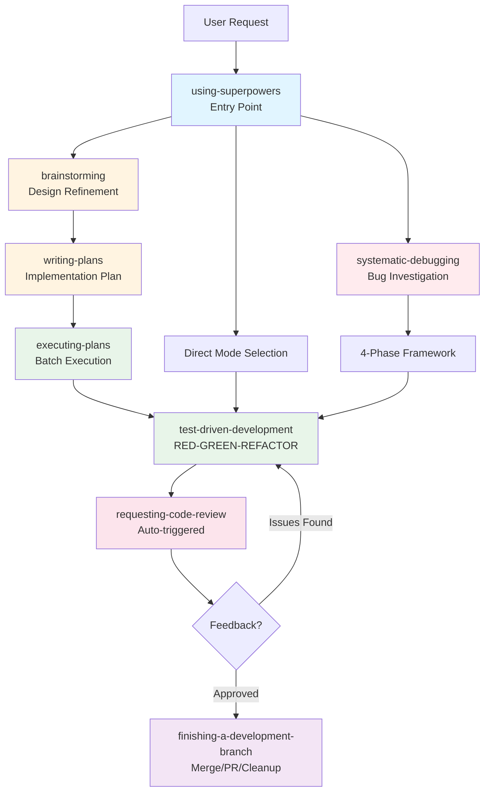
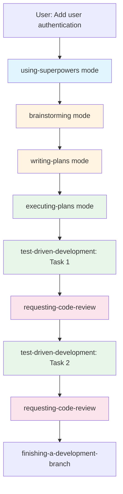
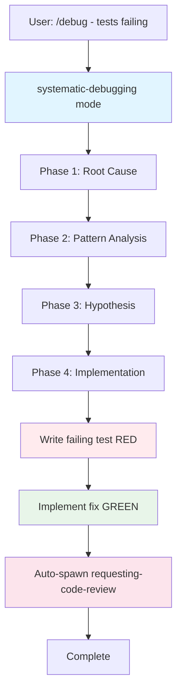
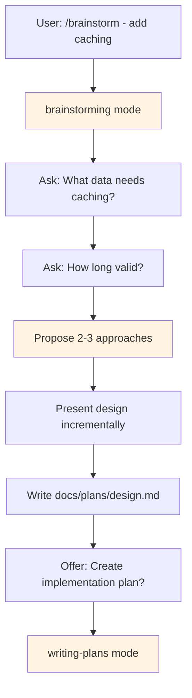

# Documentation Enhancements Implementation Plan

> **For Claude:** REQUIRED SUB-SKILL: Use superpowers:executing-plans to implement this plan task-by-task.

**Goal:** Add troubleshooting section and visual workflow diagrams to ARCHITECTURE.md

**Architecture:** Insert new troubleshooting section after "Installation Approaches" and add 4 Mermaid diagrams to "Workflow Examples" section

**Tech Stack:** Markdown, Mermaid diagrams

---

## Task 1: Add Troubleshooting Section

**Files:**
- Modify: `docs/ARCHITECTURE.md:208-209`

**Step 1: Read current ARCHITECTURE.md**

Read the file to verify insertion point:
```bash
sed -n '205,212p' docs/ARCHITECTURE.md
```

Expected: Should see end of "Installation Approaches" section and start of "Workflow Examples"

**Step 2: Insert troubleshooting section**

Insert after line 207 (the `---` separator after Installation Approaches), before line 209 (`## Workflow Examples`):

```markdown
## Troubleshooting

Quick solutions to common SuperRoo issues.

### Mode not appearing in dropdown

**Symptom:** RooCode mode selector doesn't show 20 SuperRoo skill-modes

**Solution:**
1. Verify file location: `~/.config/Code/User/roo-code-settings/customModes.json` (macOS/Linux) or `%APPDATA%\Code\User\roo-code-settings\customModes.json` (Windows)
2. Restart VS Code completely (not just reload window)
3. Validate YAML: `python3 -c "import yaml; yaml.safe_load(open('.roomodes'))"`

### Slash commands don't work

**Symptom:** Typing `/tdd` or `/debug` doesn't trigger commands

**Solution:**
1. Check `.roo/commands/` directory exists with 7 .md files
2. Restart VS Code completely
3. Verify RooCode extension is active in VS Code extensions panel

### Wrong mode activates

**Symptom:** Selecting one mode activates a different one

**Solution:**
1. Check for duplicate slugs in `.roomodes` file
2. Project-specific `.roomodes` may override global settings
3. Remove project-specific `.roomodes` if not intended

### Auto-review not triggering

**Symptom:** test-driven-development completes without spawning requesting-code-review

**Solution:**
1. Verify mode has `new_task()` call in roleDefinition section
2. Check RooCode version supports `new_task()` (update if needed)
3. Review mode definition in `.roomodes` for syntax errors

### Skills don't compose (subtasks fail)

**Symptom:** Modes don't spawn other modes via `new_task()`

**Solution:**
1. Enable auto-approval for read operations in VS Code settings (speeds up subtasks)
2. Check RooCode console (View → Output → RooCode) for errors
3. Verify `.roomodes` doesn't have syntax errors

**Still having issues?**
- Check [GitHub Issues](https://github.com/Benny-Lewis/super-roo/issues)
- File a new issue with: RooCode version, error messages, `.roomodes` content, steps to reproduce

---

```

Use the Edit tool to insert this content.

**Step 3: Verify insertion**

Check that troubleshooting section appears correctly:
```bash
sed -n '208,280p' docs/ARCHITECTURE.md | head -40
```

Expected: Should see troubleshooting section between Installation Approaches and Workflow Examples

**Step 4: Commit**

```bash
git add docs/ARCHITECTURE.md
git commit -m "Add troubleshooting section to ARCHITECTURE.md

- 5 common issues with symptom/solution format
- Clear escalation path to GitHub issues
- Located between Installation and Workflow sections"
```

---

## Task 2: Add Comprehensive Overview Diagram

**Files:**
- Modify: `docs/ARCHITECTURE.md` (Workflow Examples section start)

**Step 1: Find insertion point**

Check current Workflow Examples section structure:
```bash
sed -n '209,215p' docs/ARCHITECTURE.md
```

Expected: Should see `## Workflow Examples` header

**Step 2: Add comprehensive diagram after section header**

Insert after line 209 (`## Workflow Examples`), before line 211 (`### Example 1:`):

```markdown

### Overview: All Workflows

This diagram shows how all SuperRoo workflows relate and compose:



**Color Legend:**
- **Blue**: Entry points
- **Yellow**: Planning/Design
- **Green**: Implementation
- **Red**: Debugging
- **Pink**: Review
- **Purple**: Completion

---

```

Use the Edit tool to insert this content.

**Step 3: Verify diagram syntax**

Check that Mermaid syntax is correct:
```bash
grep -A 30 "Overview: All Workflows" docs/ARCHITECTURE.md | head -35
```

Expected: Should see complete Mermaid diagram with proper syntax

**Step 4: Commit**

```bash
git add docs/ARCHITECTURE.md
git commit -m "Add comprehensive workflow overview diagram

- Shows all major workflows in one view
- Color-coded by workflow stage
- Located at start of Workflow Examples section"
```

---

## Task 3: Add Feature Implementation Diagram

**Files:**
- Modify: `docs/ARCHITECTURE.md` (before Example 1 text)

**Step 1: Find Example 1 location**

```bash
grep -n "### Example 1: Feature Implementation" docs/ARCHITECTURE.md
```

Expected: Line number for Example 1 heading

**Step 2: Add diagram before Example 1 text**

Insert after `### Example 1: Feature Implementation` heading, before the text block:

```markdown

**Visual workflow:**



**Detailed walkthrough:**

```

Use the Edit tool to insert this content.

**Step 3: Verify diagram placement**

```bash
sed -n '$(grep -n "Example 1" docs/ARCHITECTURE.md | cut -d: -f1),+40p' docs/ARCHITECTURE.md
```

Expected: Diagram appears between heading and text

**Step 4: Commit**

```bash
git add docs/ARCHITECTURE.md
git commit -m "Add feature implementation workflow diagram

- Shows full design → implement → review cycle
- Demonstrates skill composition pattern
- Located before Example 1 text"
```

---

## Task 4: Add Bug Fix Diagram

**Files:**
- Modify: `docs/ARCHITECTURE.md` (before Example 2 text)

**Step 1: Find Example 2 location**

```bash
grep -n "### Example 2: Quick Bug Fix" docs/ARCHITECTURE.md
```

Expected: Line number for Example 2 heading

**Step 2: Add diagram before Example 2 text**

Insert after `### Example 2: Quick Bug Fix` heading, before the text block:

```markdown

**Visual workflow:**



**Detailed walkthrough:**

```

Use the Edit tool to insert this content.

**Step 3: Verify diagram placement**

```bash
sed -n '$(grep -n "Example 2" docs/ARCHITECTURE.md | cut -d: -f1),+30p' docs/ARCHITECTURE.md
```

Expected: Diagram appears between heading and text

**Step 4: Commit**

```bash
git add docs/ARCHITECTURE.md
git commit -m "Add bug fix workflow diagram

- Shows 4-phase debugging framework
- Demonstrates TDD integration for fixes
- Located before Example 2 text"
```

---

## Task 5: Add Design Refinement Diagram

**Files:**
- Modify: `docs/ARCHITECTURE.md` (before Example 3 text)

**Step 1: Find Example 3 location**

```bash
grep -n "### Example 3: Design Refinement" docs/ARCHITECTURE.md
```

Expected: Line number for Example 3 heading

**Step 2: Add diagram before Example 3 text**

Insert after `### Example 3: Design Refinement` heading, before the text block:

```markdown

**Visual workflow:**



**Detailed walkthrough:**

```

Use the Edit tool to insert this content.

**Step 3: Verify diagram placement**

```bash
sed -n '$(grep -n "Example 3" docs/ARCHITECTURE.md | cut -d: -f1),+25p' docs/ARCHITECTURE.md
```

Expected: Diagram appears between heading and text

**Step 4: Commit**

```bash
git add docs/ARCHITECTURE.md
git commit -m "Add design refinement workflow diagram

- Shows Socratic brainstorming process
- Demonstrates incremental design presentation
- Located before Example 3 text"
```

---

## Task 6: Verify All Diagrams Render

**Files:**
- None (verification only)

**Step 1: Check file compiles**

Ensure markdown is valid:
```bash
wc -l docs/ARCHITECTURE.md
```

Expected: ~550-600 lines (increased from 442)

**Step 2: Push to GitHub**

```bash
git push origin main
```

Expected: Successful push

**Step 3: View on GitHub**

Open: `https://github.com/Benny-Lewis/super-roo/blob/main/docs/ARCHITECTURE.md`

Verify:
- [ ] Troubleshooting section appears with 5 issues
- [ ] Comprehensive overview diagram renders
- [ ] Feature implementation diagram renders
- [ ] Bug fix diagram renders
- [ ] Design refinement diagram renders
- [ ] All diagram colors appear correctly

**Step 4: Test diagram interactivity**

On GitHub, verify:
- Diagrams are clear and readable
- Colors distinguish different workflow stages
- Text in nodes is legible
- Arrows point in correct directions

---

## Task 7: Update Design Document

**Files:**
- Modify: `docs/plans/2025-01-25-documentation-enhancements-design.md`

**Step 1: Add implementation notes**

Append to design document:

```markdown

---

## Implementation Complete

**Date:** 2025-01-25
**Status:** ✅ Implemented

### Changes Made
1. Added troubleshooting section (5 common issues) after Installation Approaches
2. Added 4 Mermaid diagrams to Workflow Examples section:
   - Comprehensive overview at section start
   - Feature implementation diagram before Example 1
   - Bug fix diagram before Example 2
   - Design refinement diagram before Example 3

### File Modified
- `docs/ARCHITECTURE.md` - Added ~150 lines (442 → ~590 lines)

### Verification
- ✅ All diagrams render correctly on GitHub
- ✅ Troubleshooting section is clear and actionable
- ✅ Diagrams complement existing text examples
- ✅ Color coding is intuitive and consistent

### Commits
- Add troubleshooting section to ARCHITECTURE.md
- Add comprehensive workflow overview diagram
- Add feature implementation workflow diagram
- Add bug fix workflow diagram
- Add design refinement workflow diagram
```

Use the Edit tool to append this content.

**Step 2: Commit design update**

```bash
git add docs/plans/2025-01-25-documentation-enhancements-design.md
git commit -m "Mark documentation enhancements as implemented"
```

**Step 3: Final verification**

```bash
git log --oneline -6
```

Expected: Should see 6 commits (5 implementation + 1 design update)

---

## Success Criteria

**Troubleshooting Section:**
- [x] 5 common issues documented
- [x] Symptom → Solution format is clear
- [x] Escalation path to GitHub included
- [x] Located between Installation and Workflow sections

**Visual Diagrams:**
- [x] 4 Mermaid diagrams added
- [x] All diagrams render correctly on GitHub
- [x] Colors distinguish workflow stages
- [x] Diagrams complement text examples

**Overall:**
- [x] ARCHITECTURE.md increased by ~150 lines
- [x] Documentation remains maintainable
- [x] No broken links or syntax errors

---

## Notes

- Use Edit tool for all file modifications (not Write, since file already exists)
- Each task is independent and can be committed separately
- Verify diagrams on GitHub after pushing (Mermaid renders server-side)
- Troubleshooting section should be kept up-to-date as common issues emerge
