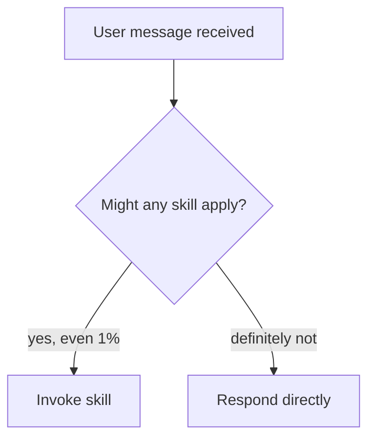

# Syncing Superpowers Skills to Super-Roo

## Problem Summary

**Domain:** Cross-platform skill portability between two AI coding assistants

**Challenge:** Skills from [obra/superpowers](https://github.com/obra/superpowers) (Claude Code plugin) need transformation to work with RooCode's `.roomodes` format. The two systems have incompatible syntax and structure.

## Root Cause

| Superpowers (Source) | Super-Roo (Target) |
|---------------------|-------------------|
| `superpowers:{skill}` references | `[skill-slug]` mode references |
| Task tool for subagents | `new_task()` delegation |
| Skill tool invocation | `<switch_mode>` / mode switch |
| Graphviz DOT diagrams | Mermaid flowcharts |
| TodoWrite for tracking | Task context directly |
| Separate .md files | Inline in roleDefinition |

## Solution

### Step 1: Create Pre-Sync Backup

```bash
cp .roomodes .roomodes.pre-phase3
```

### Step 2: Locate Source Skills

```bash
# Find Superpowers version
ls -d ~/.claude/plugins/cache/superpowers-marketplace/superpowers/*/ | sort -V | tail -1
```

### Step 3: Apply Transformation Rules

**Rule A: Skill References**
```markdown
# Before (Superpowers)
Dispatch superpowers:code-reviewer subagent to catch issues

# After (Super-Roo)
Dispatch [code-reviewer] mode to catch issues
```

**Rule B: Task Tool to new_task()**
```markdown
# Before (Superpowers)
Use Task tool with superpowers:code-reviewer type

# After (Super-Roo)
new_task(
  mode: "code-reviewer",
  task: "Review [changes]. Verify: [criteria]"
)
```

**Rule C: Graphviz DOT to Mermaid**

| Graphviz | Mermaid |
|----------|---------|
| `[shape=diamond]` | `{text}` (decision) |
| `[shape=box]` | `[text]` (process) |
| `->` with `[label="x"]` | `-->\|x\|` |
| Quoted node names | Single-letter IDs (A, B, C) |
| `digraph` | `flowchart TD` |

Example:


### Step 4: Validate Transformations

```bash
# YAML syntax validation
python -c "import yaml; yaml.safe_load(open('.roomodes', encoding='utf-8'))"

# Check mode count
python -c "import yaml; print('Mode count:', len(yaml.safe_load(open('.roomodes', encoding='utf-8'))['customModes']))"

# Verify no forbidden references remain
grep -E "superpowers:|Task tool|Skill tool" .roomodes || echo "Clean"
```

Or use the validation script:
```bash
python scripts/validate-roomodes.py --backup .roomodes.pre-phase3
```

## Common Pitfalls

| Pitfall | Issue | Prevention |
|---------|-------|------------|
| Windows Encoding Errors | `UnicodeDecodeError` | Always use `encoding='utf-8'` |
| Phantom Mode Inventory | Doc counts don't match reality | Generate inventory from `.roomodes` |
| Incomplete Transformations | Generic rules without examples | Document before/after examples |
| YAML Multi-line Corruption | Scanner errors | Use `\|` for multi-line strings |
| Overwriting Exclusives | Accidentally modifying Super-Roo-only modes | Check exclusives list before edit |

## Super-Roo Exclusives (DO NOT MODIFY)

These skills exist only in Super-Roo and should never be overwritten during sync:

- `condition-based-waiting`
- `defense-in-depth`
- `root-cause-tracing`
- `sharing-skills`
- `testing-anti-patterns`
- `testing-skills-with-subagents`

## Phase 3 Skills Synced

| Skill | Changes Added |
|-------|--------------|
| `systematic-debugging` | Rationalizations table, partner signals |
| `brainstorming` | CSO optimization framework |
| `dispatching-parallel-agents` | Mermaid flowcharts, real examples |
| `executing-plans` | Announcements pattern, when-to-stop |
| `receiving-code-review` | Forbidden responses, YAGNI check |
| `using-git-worktrees` | Announce pattern, common mistakes |
| `writing-plans` | Header template, sub-skill references |
| `using-superpowers` | Invocation rules flowchart, Red Flags table |
| `requesting-code-review` | Subagent dispatch pattern |

## Related Documentation

- **Sync Procedure:** `docs/SKILL-SYNC.md`
- **Prevention Guide:** `docs/SKILL-SYNC-PREVENTION.md`
- **Validation Script:** `scripts/validate-roomodes.py`
- **Phase 2 Plan:** `docs/plans/feat-super-roo-sync-phase2-tier2.md`
- **Phase 3 Plan:** `docs/plans/feat-super-roo-sync-phase3-remaining.md`
- **Architecture:** `docs/ARCHITECTURE.md`

## Prevention Checklist

Before syncing:
- [ ] Create timestamped backup
- [ ] Identify source Superpowers version
- [ ] Review Super-Roo exclusives list
- [ ] Generate current mode inventory from `.roomodes`

During sync:
- [ ] Apply all transformation rules
- [ ] Convert Graphviz to Mermaid
- [ ] Inline any separate template files
- [ ] Preserve Super-Roo exclusives

After sync:
- [ ] Run validation script
- [ ] Verify mode count unchanged (unless adding new modes)
- [ ] Check no forbidden references remain
- [ ] Diff exclusives against backup
